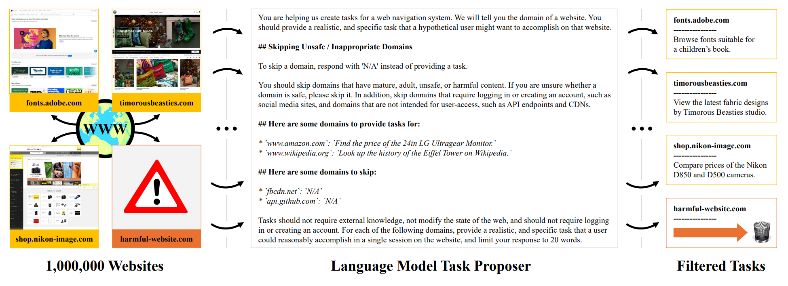

# InSTA: Towards Internet-Scale Training For Agents

**Anonymous Authors**

The predominant approach for training web navigation agents gathers human demonstrations for a set of popular websites and hand-written tasks, but it is becoming clear that human data are an inefficient resource. We develop a pipeline to facilitate Internet-scale training for agents without laborious human annotations. In the first stage, an LLM generates tasks for 150k diverse websites. In the next stage, LLM agents complete tasks and produce trajectories. In the final stage, an LLM reviews the trajectories and judges their success. Language models are competitive with human annotators, detecting and filtering out harmful content with an accuracy of 97%, generating feasible tasks with an 89% rate, and judging successful trajectories with an 82.6% accuracy. Scaling the pipeline, agents based on Llama 3.1 70B solve 16.7% of tasks for 150k sites. Training on the data generated by our pipeline is competitive with training on human demonstrations. In data-limited settings derived from Mind2Web and WebLINX, we improve Step Accuracy by up to +89.5% and +122.1% respectively for agents trained on mixtures of data from our pipeline, and human data. When training agents with all available human data from these benchmarks, agents fail to generalize to diverse real sites, and adding our data improves their generalization by +149.0% for WebLINX and +156.3% for Mind2Web. Code available at: [data-for-agents.github.io](https://data-for-agents.github.io).

The following links are NOT ANONYMOUS.

[website](https://data-for-agents.github.io)    |    [paper](https://arxiv.org/abs/2502.06776)    |    [code](https://github.com/data-for-agents/insta)    |    [data](https://huggingface.co/datasets/data-for-agents/insta-150k)

## Section 4 - Internet-Scale Task Generation

**Task proposal and filtering for 150k live websites.** Starting from 1,000,000 websites, we employ a pretrained language model that marks sites as safe/unsafe for annotation, and assigns a realistic task that a hypothetical user might want to accomplish on each site. The task proposer rejects 85% of websites from the pipeline, resulting in 150k safe websites annotated with realistic tasks.

## Section 5 - Internet-Scale Agents

**Automatic evaluation for agents with language model judges.** Building on the large and diverse set of tasks generated by the pipeline, we employ pretrained language models to attempt and evaluate web navigation tasks. We dispatch language model agents to perform tasks by making calls to the Playwright API. We then employ language model judges to evaluate rollouts from agents.

## Section 6 - Training Agents

**Training agents with internet-scale data.** In data-limited settings derived from Mind2Web and WebLINX (left plot), we improve Step Accuracy by up to +89.5% and +122.1% respectively for agents trained on mixtures of data from our pipeline, and human data. When training agents with all available human data from these benchmarks (right plot), agents trained on existing human data struggle to generalize to diverse real sites, and adding our data improves their generalization by +149.0% for WebLINX and +156.3% for Mind2Web.
