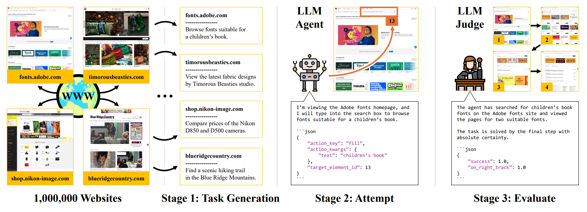
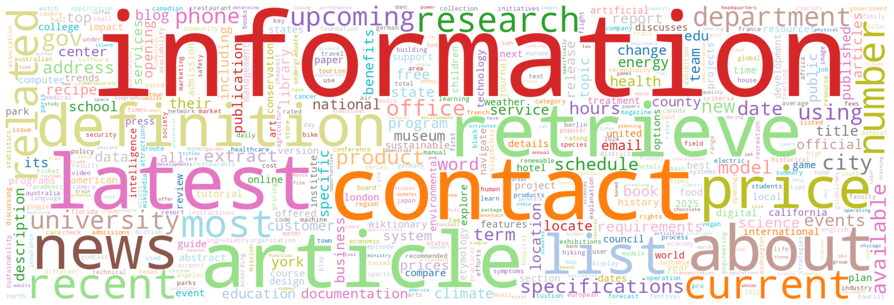
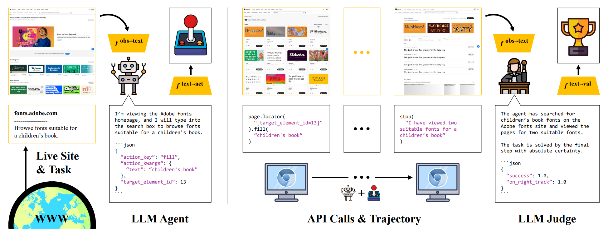
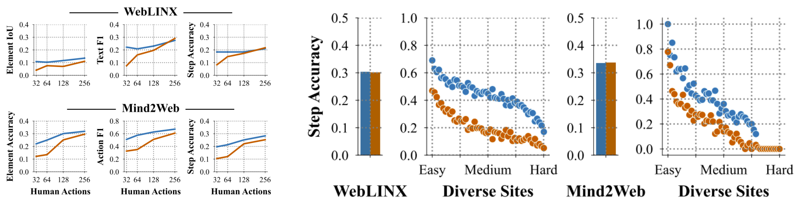

# InSTA: Towards Internet-Scale Training For Agents

**Anonymous Authors**

The predominant approach for training web navigation agents is to gather human demonstrations for a set of popular websites and hand-written tasks, but it is becoming clear that human data is an inefficient resource. We develop a pipeline to facilitate internet-scale training for agents without laborious human annotations. In the first stage, an LLM annotates 150k sites with agentic tasks. In the next stage, LLM agents complete tasks and produce trajectories. In the final stage, an LLM filters trajectories by judging their success. Language models are powerful data curation tools, identifying harmful content with an accuracy of 97%, judging successful trajectories with an accuracy of 82.6%, and producing effective data. We train agents based on *Qwen 3 1.7B* that are competitive with frontier LLMs as web agents, while being smaller and faster. Our top agent reaches a success rate of 56.9%, outperforming the data collection policy *Qwen 3 235B*, a 235 times larger *Llama 4 Maverick*, and reaching 94.7% of the performance of *Gemini 2.5 Flash*. We are releasing code, models and data at: [data-for-agents.github.io](https://data-for-agents.github.io).

The following links are NOT ANONYMOUS.

[website](https://data-for-agents.github.io)    |    [paper](https://arxiv.org/abs/2502.06776)    |    [code](https://github.com/data-for-agents/insta)    |    [data](https://huggingface.co/datasets/data-for-agents/insta-150k-v3)

## Section 4 - Internet-Scale Task Generation

**Overview of the InSTA pipeline.** Our work unlocks a dynamic internet-scale environment that allows training small models that match top industry LLMs as agents, on a fraction of the budget. Starting from the top 1M sites on the internet, we efficiently annotate 150k sites with challenging agentic tasks, and release the entire pipeline, including code, models and an official huggingface dataset.

### Exploring The Tasks

**Most frequent words in our tasks.** This wordcloud shows the top 500 most frequent words in tasks from the training set of our official huggingface dataset. The size of each word corresponds to its frequency in the dataset. Our tasks span diverse categories and lexicon.

## Section 5 - Internet-Scale Environment

**Unlocking a dynamic internet-scale environment.** Building on the large and diverse set of tasks, we employ pretrained language models to attempt and evaluate tasks. We run language model agents to perform tasks using the Playwright API. We then employ language model judges to evaluate trajectories.

## Section 6 - Training Agents

**InSTA unlocks great potential in small models.** We train agents based on *Qwen 3 1.7B* using trajectories produced by a *Qwen 3 235B* data collection policy, and optionally filtered by a *Qwen 3 235B* judge (see Judge Filtered vs. Uniformly Sampled). We report success rates on a test set of 3,000 held-out websites and tasks. Before training, *Qwen 3 1.7B* has a zero-shot success rate of 11.5% according to a *Qwen 3 235B* judge, and we improve this by +45.3% absolute percentage points. Our top checkpoint outperforms the *Qwen 3 235B* data collection policy, and *Llama 4 Maverick*, a frontier LLM with 400B parameters, for which our model is 235 times smaller. Notably, filtering with a *Qwen 3 235B* judge leads to agents that improve according to independent secondary judges, including *Gemini 2.5 Flash*, *Llama 4 Maverick*, and *Gpt 4.1 Nano*, suggesting it generalizes well.
